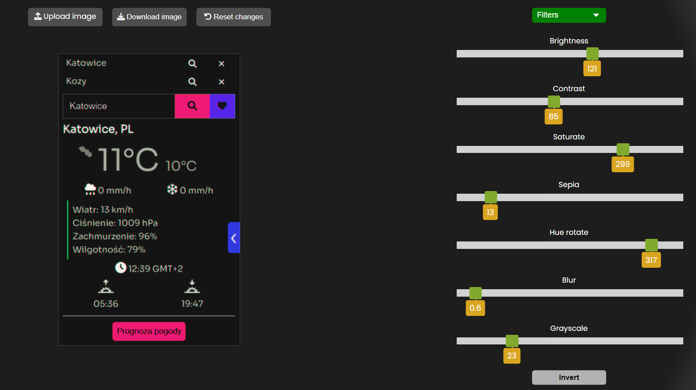
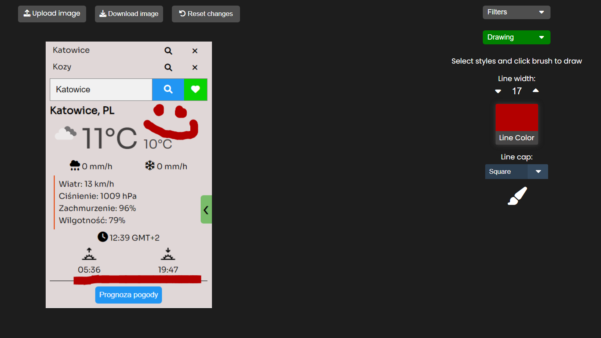

# Image Editor
Made in JavaScript, layout made in HTML and SCSS.<br />
## Get the code
```bash
git clone https://github.com/rnycz/image-editor.git
```
## How it works?
Upload an image from your device and edit it as you like. <br />
<br />
Draw on the picture.<br />
<br />
The edited image can be downloaded.